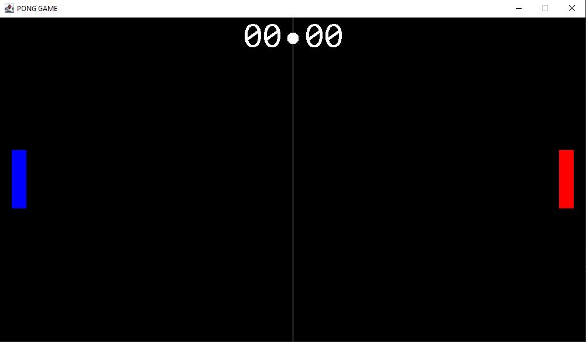

# pong-game
 Ping pong game developed in Java, with the components of Swing. The game is client-server, for a maximum of two connected Clients.

 ## Game Interface
 

 ## How to play
 Game keys:
 * W - Up
 * S - Down

